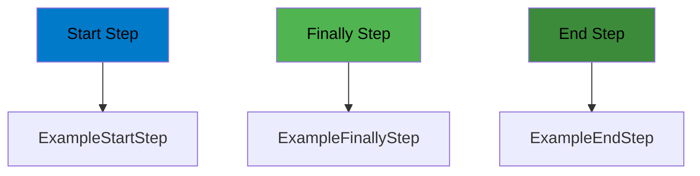

# Business Scenario Empty

## Scenario - Diagram

```mermaid
graph TD
classDef startClass fill: #007ac9, color:#000000;
classDef finallyClass fill: #50b450, color:#000000;
classDef endClass fill: #3b8b3b, color:#000000;
    StartStep["Start Step"]:::startClass  --> ExampleStartStep
    FinallyStep["Finally Step"]:::finallyClass --> ExampleFinallyStep
    EndStep["End Step"]:::endClass --> ExampleEndStep
```

__NOTE__: Generated with vs code extension `Automation Business Scenarios Renderer`. Running task `Convert Business Scenario to Mermaid Flowchart`
