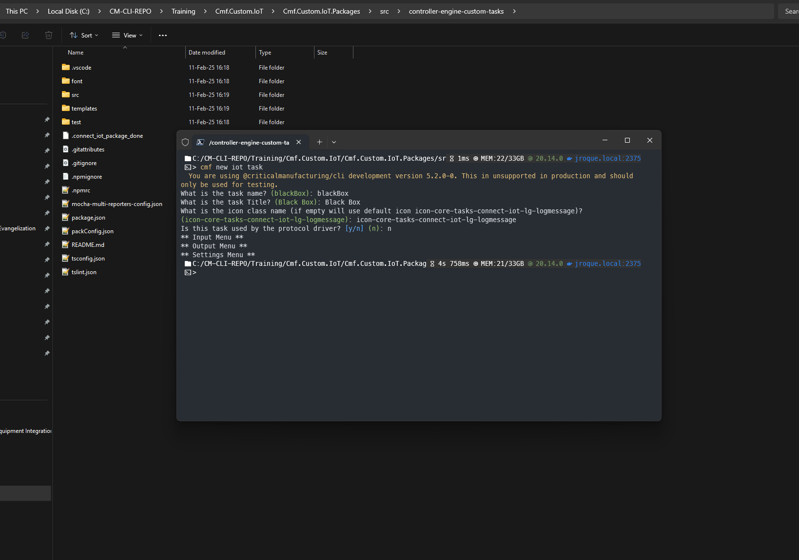

# Guide: IoT on MES v11

The MES Version v11 simplifies customization by merging all the generators under the CLI. 

## Structure 

When generating the Connect IoT customization `cmf new iot` it will generate three packages:

* `IoT` - The IoT root package;
* `IoT.Data` - To store master data for IoT-related MES entities (e.g. controllers, workflows, drivers, etc);
* `IoT.Package` - To hold all the custom IoT components, like Tasks, Converters and Drivers.

**e.g.**:

``` log
📦Cmf.Custom.IoT
┣ 📂Cmf.Custom.IoT.Data
┃ ┣ 📂AutomationWorkFlows
┃ ┃ ┣ 📂FileHandler
┃ ┃ ┃ ┗ 📜Setup.json
┃ ┣ 📂MasterData
┃ ┃ ┗ 📂1.0.0
┃ ┃ ┃ ┗ 📜FileHandlerMasterData.json
┃ ┗ 📜cmfpackage.json
┣ 📂Cmf.Custom.IoT.Packages
┃ ┣ 📂src
┃ ┃ ┗ 📜...
┃ ┣ 📜cmfpackage.json
┗ 📜cmfpackage.json
```

The `IoT.Data` package is composed of two folders:

*  AutomationWorkFlows - To hold the exported JSON files that constitute the IoT automation workflows to be used in the MES.
*  MasterData - To hold the actual master data files with IoT entities.

!!! important

    When referring to IoT Workflows on the IoT master data files, their path should be relative to the AutomationWorkFlows folder.
    
    **e.g.**: Compare the below master data paths with the previous IoT file structure example.
    
    ``` json
    {
        "AutomationControllerWorkflow": {
            "1": {
            "AutomationController": "InterfaceController",
            "Name": "Setup",
            "DisplayName": "Setup",
            "IsFile": "Yes",
            "Workflow": "FileHandler/Setup.json",
            "Order": "1"
            }
        }
    }
    ```

The `IoT.Packages` should be used as the workspace to create new TasksLibraries (packages that hold Connect ioT runtime components). Inside the TaskLibrary create new tasks, converters or drivers.

!!! hint

    If you don't require the IoT package or any of its sub-packages, simply delete it and remove its references from the root cmfpackage.json file.

## Generating IoT Components

In a clean run where the goal would be to create a new custom task, we would do the following steps:

```bash
cmf new iot
```


To generate a TaskLibrary package with a task, we would execute the following steps:

### Task Library

Generating a new task library (connect iot package):

```bash
cmf new iot taskLibrary
```


Generating a new task:

```bash
cmf new iot task
```


Generating a new converter:

```bash
cmf new iot converter
```



### Driver

Generating a new Driver:

```bash
cmf new iot driver
```


### Business Scenario

Generating a Business Scenario:

```bash
cmf new iot businessScenario
```


## For Angular

The user can still generate angular task libraries. These will not use Automation Task Libraries and will be angular components. After generating the iot package for angular. Generate the iot components.

In order to generate a new task library (connect iot package) run:

```bash
ng generate library
```

In the generated task library (connect iot package). Tasks and converters can be generated by running:
```bash
ng g @criticalmanufacturing/ngx-iot-schematics:task <name>
```

```bash
ng g @criticalmanufacturing/ngx-iot-schematics:converter <name>
```
