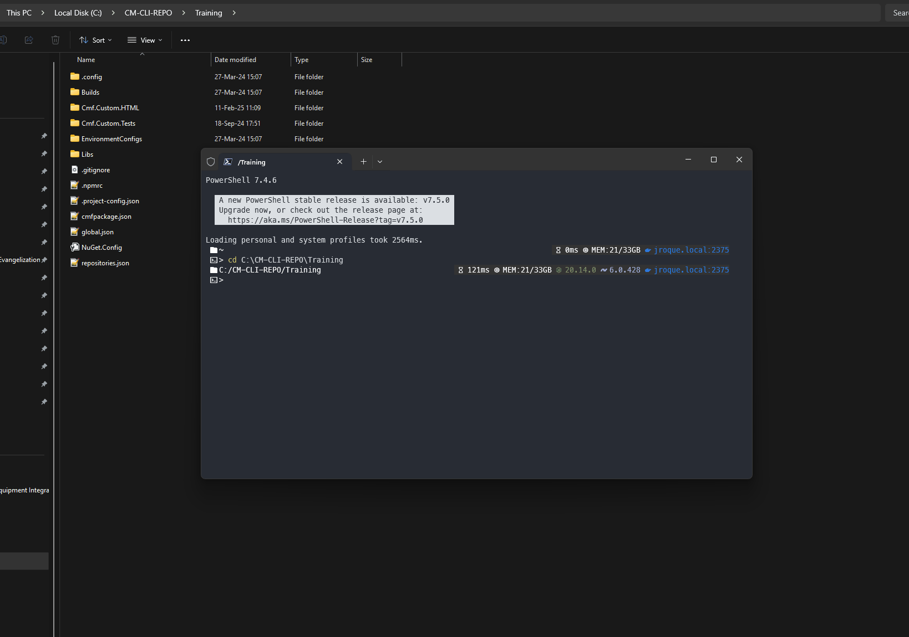
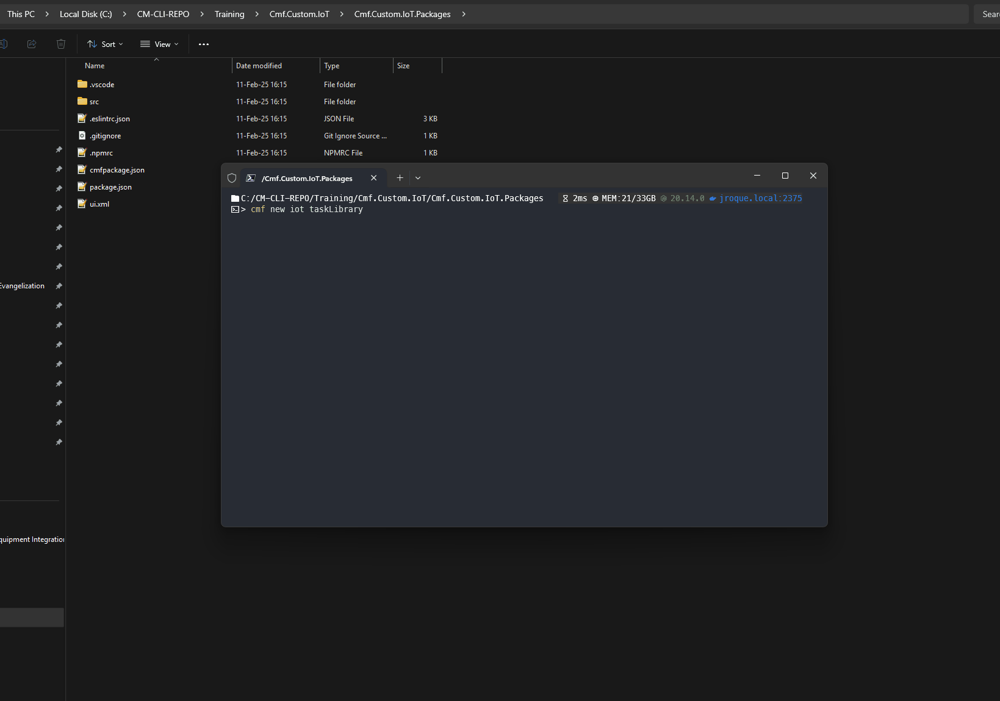
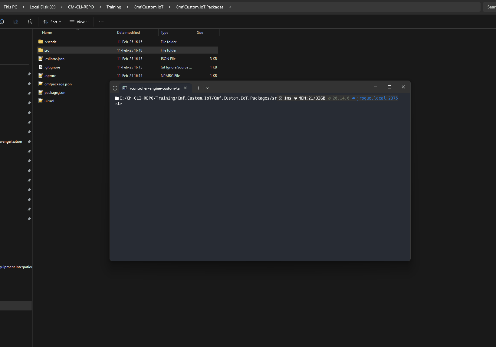
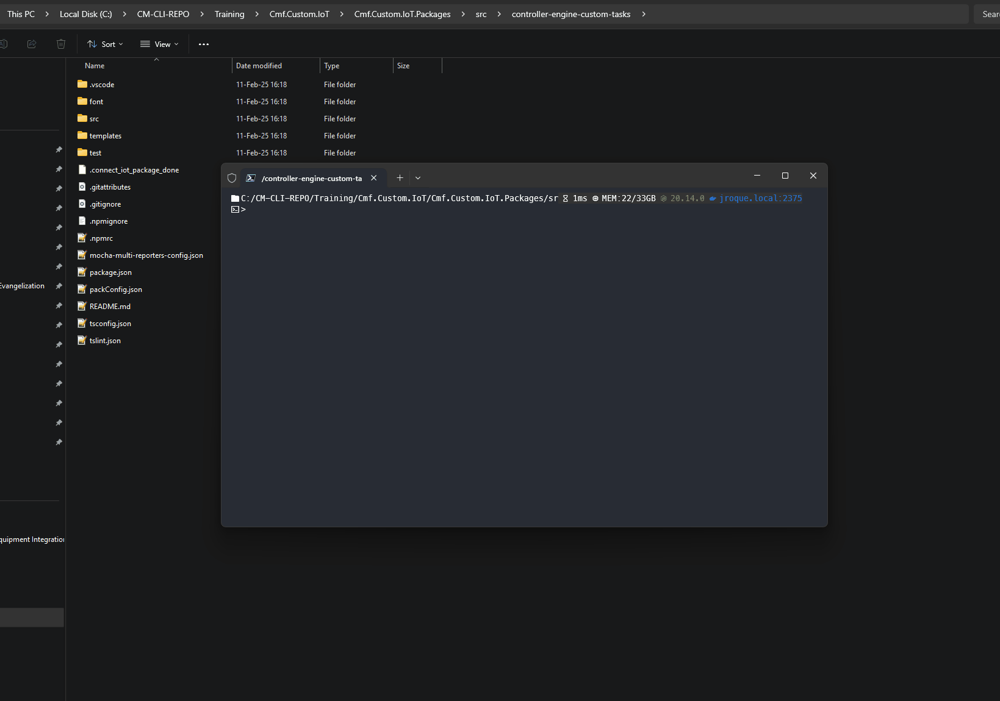
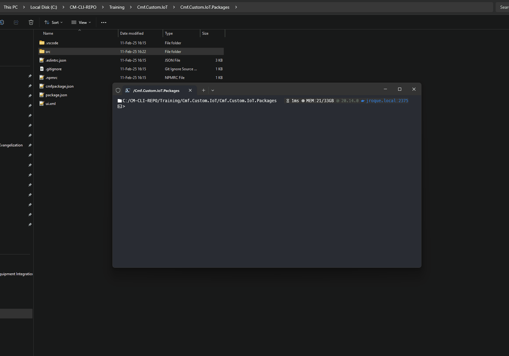

# Guide: IoT Scaffolding

This guide explains how to scaffold your IoT customization project for Critical Manufacturing MES. It covers both the modern **Automation Task Libraries (ATLs)** and the deprecated **Tasks Packages Libraries**.

## Key Concepts

Before diving into the scaffolding procedures, let's define some key concepts:

* **Library:** In this context, a library is the customization IoT package that user sees on the MES UI, containing a set of drivers, tasks, and converters.
* **Driver:** A driver implements the communication protocol required to interact with a specific IoT device or external system. It handles the low-level details of sending and receiving data.
* **Custom Task:** A custom task is a function or method that performs a specific action within the MES workflow. It has defined inputs and outputs and can be triggered by events or other tasks.
* **Custom Converter:** A custom converter transforms the output of a task into a different format or data type. This is often necessary to ensure compatibility with other systems or tasks.
* **Automation Task Library (ATL):** The recommended approach for MES v11 and later to create an IoT Task Library. ATLs separate UI metadata from the Node.js package. This metadata required to render tasks and converts on the MES UI, is now stored as a `json` file in the MES entity called `AutomationTaskLibrary`. This change has improved Workflow Designer experience and removed UI and IoT components inter-dependencies.
* **Tasks Package Library (Deprecated):** An older method for creating custom IoT logic, used in MES v7 through v10. It tightly couples the UI and the custom code, making it less flexible than ATLs.

## Supported IoT Code Extensions

Critical Manufacturing IoT supports code extensions through the following:

* **Libraries:** Creating libraries containing objects subject to IoT extensions.
* **Drivers:** Implementing protocols to interact with IoT devices or unsupported external systems.
* **Custom Tasks:** Developing functions or methods with a name, inputs, outputs, and an action.
* **Custom Converters:** Developing converters to transform task outputs into different formats or types.

## Project Structure

When generating the Connect IoT customization with the `cmf new iot` command, it will generate three packages:

* `IoT` - The IoT root package;
* `IoT.Data` - To store master data for IoT-related MES entities (e.g. controllers, workflows, drivers, etc);
* `IoT.Package` - To hold all the custom IoT components, like Tasks, Converters and Drivers.

```log
...
📦Cmf.Custom.IoT
┣ 📂Cmf.Custom.IoT.Data             # Location IoT Master Data Files
┃ ┣ 📂AutomationWorkFlows
┃ ┃ ┣ 📂FileHandler
┃ ┃ ┃ ┗ 📜Setup.json
┃ ┣ 📂MasterData
┃ ┃ ┗ 📂1.0.0
┃ ┃ ┃ ┗ 📜FileHandlerMasterData.json
┣ 📂Cmf.Custom.IoT.Packages        # Location IoT "Tasks Package" or ATL
┃ ┣ 📂projects                             # Angular components (Tasks Packages, MES v10+)
┃ ┣ 📂src                                  # Non-Angular components (ATLs, or Tasks Packages without Angular)
┃ ┣ 📜.npmrc
┃ ┣ 📜cmfpackage.json
┃ ┣ 📜package.json
┗ 📜cmfpackage.json
...
```

The `IoT.Data` package is composed of two folders:

*  AutomationWorkFlows - To hold the exported JSON files that constitute the IoT automation workflows to be used in the MES.
*  MasterData - To hold the actual master data files with IoT entities.

    !!! warning "IoT Workflow Paths"

        When referring to IoT Workflows on the IoT master data files, their path should be relative to the AutomationWorkFlows folder.
    
        **e.g.**: Compare the below master data paths with the previous IoT file structure example.
    
        ``` json
        {
            "AutomationControllerWorkflow": {
                "1": {
                "AutomationController": "InterfaceController",
                "Name": "Setup",
                "DisplayName": "Setup",
                "IsFile": "Yes",
                "Workflow": "FileHandler/Setup.json",
                "Order": "1"
                }
            }
        }
        ```

The `IoT.Packages` should be used as the workspace to create new TasksLibraries (packages that hold Connect ioT runtime components). Inside the TaskLibrary create new tasks, converters or drivers.

!!! hint
    If you don't require the IoT package or any of its sub-packages, simply delete it and remove its references from the root `cmfpackage.json` file.

Bare in mind, the following project structure variations may occur:

* The `Cmf.Custom.IoT.Data` folder might be named `IoTData`. This folder contains configuration and master data related to your IoT solution.
* The `Cmf.Custom.IoT.Packages` folder might be named `IoTPackages`. This folder contains the actual code for your custom IoT logic (drivers, tasks, converters).
* The `projects` folder is created *only* when generating a *Tasks Package* library *with Angular support* (MES v10 onwards). This folder contains the Angular components that provide the user interface for your custom tasks.
* The `src` folder is present when you are developing an *ATL*, or when you are using *Tasks Packages* but *without* Angular components. It contains the core logic of your drivers, tasks, and converters.

## Scaffolding Procedures

The scaffolding process differs depending on the IoT library type (ATL or Tasks Package) and the MES version.

### Automation Task Library (ATL) Scaffolding

#### Tools

`@criticalmanufacturing/cli`

#### Steps

1. Generate the base structure:

    ```powershell
    cd {{project_or_feature_root_dir}}
    cmf new iot
    ```

2. Generate a custom driver (if needed):

    ```powershell
    cd {{project_or_feature_root_dir}}/Cmf.Custom.IoT/Cmf.Custom.IoT.Packages/src
    cmf new iot driver
    ```

3. Generate a custom Task Library (if needed):

    ```powershell
    cd {{project_or_feature_root_dir}}/Cmf.Custom.IoT/Cmf.Custom.IoT.Packages/src
    cmf new iot taskLibrary
    ```

4. Generate a custom Task (if needed):

    ```powershell
    cd {{project_or_feature_root_dir}}/Cmf.Custom.IoT/Cmf.Custom.IoT.Packages/src/{{library_name}}
    cmf new iot task
    ```

5. Generate a custom Converter (if needed):

    ```powershell
    cd {{project_or_feature_root_dir}}/Cmf.Custom.IoT/Cmf.Custom.IoT.Packages/src/{{library_name}}
    cmf new iot converter
    ```

6. Generating a Business Scenario (if needed):

    ```powershell
    cd {{project_or_feature_root_dir}}/Cmf.Custom.IoT/Cmf.Custom.IoT.Packages
    cmf new iot businessScenario
    ```

#### Demo

The following images demo the scaffolding procedures for IoT ATL custom library and its components:

* `cmf new iot`

    

* Generating ATL Task Library

    

* Generating a Driver

    

* Generating a Task

    

* Generating a Converter

    

* Generating a Business Scenario

    

### Tasks Package Scaffolding - MES v10 or above

!!! important "IoT Tasks Package depends on UI"
    Version v10 introduces a dependency between Connect IoT customization and the GUI when using Task Packages. The GUI requires compile-time access to the Connect IoT customization. Therefore, you must have an HTML package.

#### Tools

`@criticalmanufacturing/cli`, `@angular/cli`, `Yeoman`

#### Steps

1. Ensure you have an existing UI/HTML package layer (below we assume it exists at `./Cmf.Custom.HTML` directory).

2. Generate the base structure:

    ```powershell
    #Generate base structure
    cd {{project_or_feature_root_dir}}
    cmf new iot --isAngularPackage --htmlPackageLocation ./Cmf.Custom.HTML 
    
    #Install library dependencies
    cd {{project_or_feature_root_dir}}/Cmf.Custom.IoT/Cmf.Custom.IoT.Packages
    npm install
    ```

3. Generate a custom driver (if needed):

    ```powershell
    cd {{project_or_feature_root_dir}}/Cmf.Custom.IoT/Cmf.Custom.IoT.Packages
    npx yo @criticalmanufacturing/iot:driver
    ```

4. Generate a custom Tasks Package Library (if needed):

    ```powershell
    cd {{project_or_feature_root_dir}}/Cmf.Custom.IoT/Cmf.Custom.IoT.Packages/ 
    npx @angular/cli generate library {{library_name}}
    ```

5. Generate a custom Task (if needed):

    ```powershell
    cd {{project_or_feature_root_dir}}/Cmf.Custom.IoT/Cmf.Custom.IoT.Packages/projects/{{library_name}}
    npx @angular/cli generate @criticalmanufacturing/ngx-iot-schematics:task {{task_name}}
    ```

6. Generate a custom Converter (if needed):

    ```powershell
    cd {{project_or_feature_root_dir}}/Cmf.Custom.IoT/Cmf.Custom.IoT.Packages/projects/{{library_name}}
    npx @angular/cli generate @criticalmanufacturing/ngx-iot-schematics:converter {{converter_name}}
    ```

#### Post-Scaffolding

The @criticalmanufacturing/cli will automatically add an entry to the `cmfpackage.json` of the IoT package. But the reverse relation from the HTML package layer to IoT must be set manually created:

1. Edit the **HTML** `cmfpackage.json` file and add a `relatedPackages` entry, e.g.:

    ```json
        "relatedPackages": [
      {
        "path": "../Cmf.Custom.Baseline.IoT/Cmf.Custom.Baseline.IoT.Packages",
        "preBuild": true,
        "postBuild": false,
        "prePack": false,
        "postPack": false
      }
    ]
    ```

2. Add a dependency in the HTML package's `package.json` file, using the command:

    ```powershell
    npm install ../Cmf.Custom.IoT/Cmf.Custom.IoT.Packages
    ```

    * This command will add an entry like:

        ```json
        "@criticalmanufacturing/connect-iot-controller-engine-custom-tasks": "file:../Cmf.Custom.Baseline.IoT/Cmf.Custom.Baseline.IoT"
        ```

3. Finally, add code to import IoT customizations to the UI by:

    === "MES v11 onwards"

        Editing the `app.config.ts` file and add reference to the customization components, as presented on snippet below:

        ```ts
        import { Metadata as CustomTasks } from '@criticalmanufacturing/connect-iot-controller-engine-custom-tasks/metadata';

        export const appConfig: ApplicationConfig = {
            providers: [
                provideRouter(routes),
                provideServiceWorker('ngsw-loader-worker.js', {
                    enabled: !isDevMode(),
                    registrationStrategy: 'registerWhenStable:30000'
                }),
                provideMesUI(
                    {
                        tasks: [
                            CustomTasks
                        ]
                    }
                ),
                provideMetadataRouter()
            ]
        };
        ```

    === "MES v10"

        Editing the `app.module.ts` file and add reference to the customization mode, as presented on snippet below:

        ```ts
        import { Metadata as CustomTasks } from '@criticalmanufacturing/connect-iot-controller-engine-custom-tasks/metadata';
        MesUIModule.forRoot({
            tasks: [
                CustomTasks
            ]
        }),
        ...
        ```

### Tasks Package Scaffolding - MES v9 or below

#### Tools

`@criticalmanufacturing/cli`, `Yeoman`

#### Steps

1. Ensure you have an existing UI/HTML package layer (below we assume it exists at `./Cmf.Custom.HTML` directory).

2. Generate the base structure:

    ```powershell
    #Generate base structure
    cd {{project_or_feature_root_dir}}
    cmf new iot --htmlPackageLocation ./Cmf.Custom.HTML

    #Install library dependencies
    cd {{project_or_feature_root_dir}}/Cmf.Custom.IoT/IoTPackages
    npm install
    ```

3. Generate a custom driver (if needed):

    ```powershell
    cd {{project_or_feature_root_dir}}/Cmf.Custom.IoT/IoTPackages/src
    npx yo @criticalmanufacturing/iot:driver
    ```

4. Generate a custom Tasks Package Library (if needed):

    ```powershell
    cd {{project_or_feature_root_dir}}/Cmf.Custom.IoT/IoTPackages/src
    npx yo @criticalmanufacturing/iot:tasksPackage
    ```

5. Generate a custom Task (if needed):

    ```powershell
    cd {{project_or_feature_root_dir}}/Cmf.Custom.IoT/IoTPackages/src/{{tasks_package_name}}
    npx yo @criticalmanufacturing/iot:task
    ```

6. Generate a custom Converter (if needed):

    ```powershell
    cd {{project_or_feature_root_dir}}/Cmf.Custom.IoT/IoTPackages/src/{{tasks_package_name}}
    npx yo @criticalmanufacturing/iot:converter
    ```
