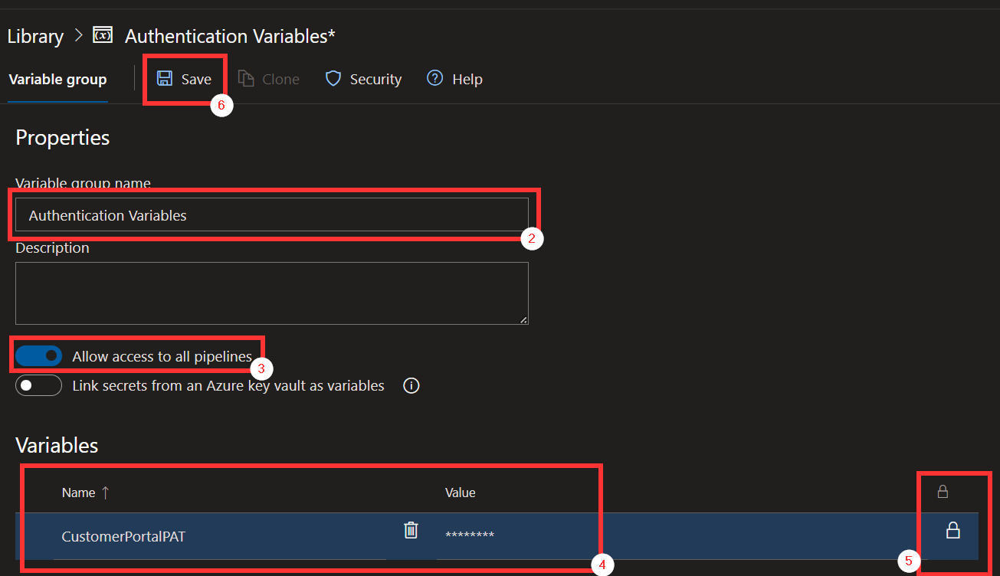

# Pipeline Import

To import the Continuous Integration pipelines, first make sure you have scaffolded your project successfully and can see a folder in the project root named Builds with several YAML files in it:

If so, we can proceed. Push your repository if you haven't yet. It is important that the default branch contains the pipeline YAML files. In our setup, the default branch is always **development**.

For each of **PR-Changes**, **PR-Package**, **CI-Changes** and **CI-Package**, repeat these steps:

1. create a new pipeline

    

1. Choose **Use the classic editor**

    

1. Choose your Team Project, repository and default branch. Our generated pipelines are expecting the default branch to be **development**

    

1. After that, choose Configuration as code > YAML

    

1. and choose the corresponding YAML file in the Builds folder

    

## Pull Request policies
To effectively leverage the Pull Request flow our pipelines enable, Azure DevOps must be configured to protect the default (in our case, **development**) branch.

Go to Repos > Branches, on the **development** row, click the More button on the far right and select Branch Policies

The policy options per-se are dependent on the team configuration and working mode. Here is an example of our policies

The important point here is to set the **PR-Changes** pipeline to run whenever a Pull Request is opened. To do so, add a new row in **Build validation** that looks like this

This will ensure the PR pipelines will run each time code is pushed to a Pull Request, and will block merging if the build is failing.

## Remaining pipelines
We do not support running the Continuous Delivery pipelines in a client setting. These pipelines are strongly opinionated on the environment in which they run and require virtual machines configured specifically for them. They are still provided as an example and guide so that each client or partner can create their own pipelines. However, they will not work out of the box and will hang on permissions issues if attempted to run.

## Secrets
The **CD-Containers** pipeline requires that a secret is specified in a variable group to run successfully. The most important one is the Customer Portal PAT (Personal Access Token). 

1. In Azure DevOps, go to Pipelines > Library and create a new Variable Group

1. Name the variable group "Docker Variables"

1. Check "Allow access to all pipelines"

1. Add a new variable named **CustomerPortalPAT** and paste your Customer Portal PAT as the value

1. Click the lock icon to turn the variable into a secret

1. Save the variable group

The pipeline will automatically use the variable group.

It is possible to add extra secrets or variables into this group, to preserve some secrets from the environment settings. Any token in the format e.g. `#{aToken}#` will be replaced with the value of the **aToken** variable.